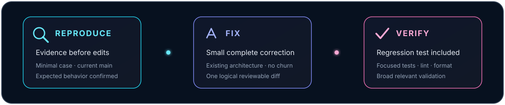

  

  
  
  

  I contribute to open-source projects by fixing reproducible bugs and adding focused regression tests.

  I'm a student building practical experience through real-world codebases and maintainer feedback. 
  I want that practice to be useful to others, so I focus on fixes that projects can review, test, and keep.

  

## What I focus on

<table>
  <tr>
    <td width="50%" valign="top">
      <h3>Correctness at the edges</h3>
      <ul>
        <li>Windows paths and cross-platform behavior</li>
        <li>Unicode, empty input, and boundary conditions</li>
        <li>Time zones, serialization, and round trips</li>
      </ul>
    </td>
    <td width="50%" valign="top">
      <h3>Reviewer-friendly changes</h3>
      <ul>
        <li>Small, complete, and focused diffs</li>
        <li>Regression coverage where practical</li>
        <li>Compatibility with existing design</li>
      </ul>
    </td>
  </tr>
</table>

  

## Tools I work with

  
  
  
  
  
  

## Selected contributions

I am currently building this list. As contributions land, this section will highlight a small selection of useful merged pull requests with clear technical impact.

  

  Clear evidence · focused changes · maintainable fixes

